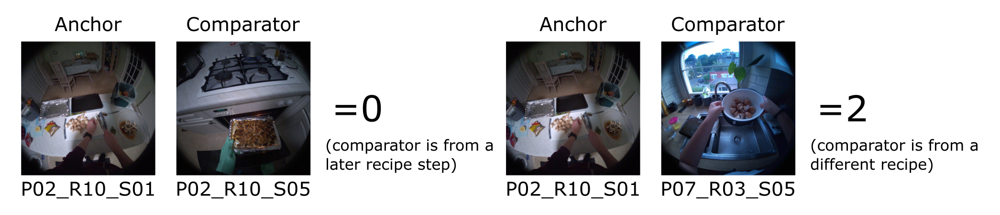
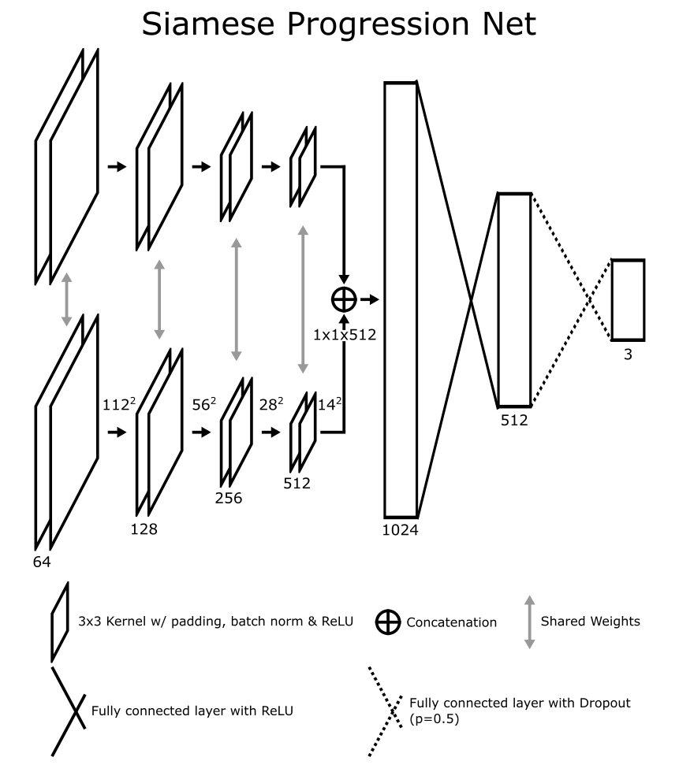

### COMSM0155: Applied Deep Learning Coursework
# Recipe Progress Classification

- [Table of Contents](#recipe-progress-classification)
  * [Task Brief](#task-brief)
  * [1. Architecture](#1-architecture)
  * [2. Dataset](#2-dataset)
  * [3. Required Results and Evaluation Metric](#3-required-results-and-evaluation-metric)
  * [4. Other details](#4-other-details)
  * [5. Example Reports](#5-example-reports)
  * [6. Extensions](#6-extensions)
  * [Final Submission](#final-submission)
  * [Marking Guideline](#marking-guideline)
  * [Universal Coursework Details](#universal-coursework-details)
    + [Deadline](#deadline)
    + [Time commitment](#time-commitment)
    + [Academic Offences](#academic-offences)
    + [Deadline Extensions](#deadline-extensions)
    + [Exceptional circumstances](#exceptional-circumstances)
  * [Appendix A: Working in a Group](#appendix-a-working-in-a-group)
  * [Appendix B: Tips for the Report Writing/Project](#appendix-b-tips-for-the-report-writingproject)
  * [Appendix C: Using the lab machines externally](#appendix-c-using-the-lab-machines-externally)


(Task for up to 3 students per team, coursework, 100%)

**We recommend reading this entire document in detail before starting the coursework.**

#### Forming your Teams:
Register your team of up to 3 people (i.e. one, two, or three students) online at: [https://forms.office.com/e/eie4uHY14T](https://forms.office.com/e/eie4uHY14T) (only one person per team needs to do this).
Post registration, teams can split but cannot merge, to avoid copying of code or ideas.

Each member of the team should submit an exact copy of the final submission on Blackboard by the deadline. The report (see below) should note the full names and usernames of all members in the team as well as a signed agreement (this can be digital) that all members contributed roughly equally (See Appendix A). All members of the group will be given the same mark.

It is up to each team to decide their best strategy to tackle this coursework, i.e. whether to divide the tasks below, or to work together on all tasks. Contributions of team members need not be explicitly stated.
However, by submitting a group coursework, you are implicitly acknowledging that all members of the team contributed approximately equally. If this is not the case, you should email the unit director with any issues encountered during the coursework (also see Appendix A).

**Note that in the past we have found no benefit in working as part of a group**, there is no correlation between mark and group size. Keep in mind the communication overhead of working in a group compared to working solo.

## Task Brief

This assignment gives you the chance to emulate working as a machine learning researcher for a novel research problem. We have designed the task so that it is similar to the models that you've used within the lab, but then you can build upon.
It will allow you to reflect on the experiencing of producing publishable results as well as thinking and justifying about certain design choices to combat any issues you may encounter.
Gathering all the knowledge you required from the lectures and labs, read the below section carefully and replicate the required results.
Feel free to take any pieces of code from the labs as a baseline.

### The Task - Recipe Progress Classification
Earlier this year, we released the [HD-EPIC dataset](https://hd-epic.github.io/), which includes recordings of people doing various daily activities in their kitchens.
This of course includes cooking and we even asked participants to record the recipes and recipe steps of what they were cooking.
You can find more information from the original paper [here](https://arxiv.org/abs/2502.04144), though there's no need to read all of this paper, we have summarised the relevant information below.

#### HD-EPIC Dataset

* 9 participants, given the names P01-P09, recorded several hours of footage each whenever they entered their kitchen until they left their kitchen. This was unscripted recordings, meaning that activities could be across different videos.
* Videos are denoted as PXX_YYYYMMDD-hhmmss in which XX is the participant number and the rest represents the date/time it was recorded in Year, Month, Day, hours, minute, seconds.
* Recipes were recorded from participants, including recipe steps as well as nutritional information and weights of ingredients.
* Recipes are denoted as PXX_RZZ where XX is the participant number and ZZ is the recipe number. For example, P01_R01 is the 1st recipe from participant 1.
* If two participants recorded the same recipe (i.e. make coffee) these are not considered the same as they may have done different steps, everyone likes their coffee a different way!
* Steps from a recipe are denoted as PXX_RZZ_SNN where XX is the participant number, ZZ is the recipe number, and NN is the step number.  For example, P03_R02_S08 is the 8th step of the 2nd recipe that participant 3 cooked.
* In some cases there are multiple instances of the same recipe, i.e. the participant made the recipe multiple times in their recording. These are denoted as instance_M where M is a 0 indexed number. **In this case, these all belong to the same recipe.**

#### Recipe Progress Classification Definition
Accordingly, we have defined a new task which, given two images each denoting individual steps in a recipe, we want to work out how the recipe steps relate to one another.
We have pre-extracted images from the videos such that each step has a single image that best represents the step. These will be the inputs to the model.
The first image is known as the _'anchor'_ and the second is the image we want to compare against the anchor, we will label this the _'comparator'_.
* **0**: If the anchor and the comparator are from the same recipe **and** the comparator is from a _later recipe step_.
* **1**: If the anchor and the comparator are from the same recipe **and** the comparator is from an _earlier recipe step_.
* **2**: If the anchor and the comparator are from different recipes.

Two examples can be seen below:



During **Training**, the code we have provided randomly selects an anchor and a comparator image, this effectively gives n^2 different training examples from n images. However, for **validation and testing**, we have given a list of pairs as sets to evaluate on so that they stay consistent. Otherwise, you may not know whether your model has improved or simply got an easier val/test set!

**Note:** With three classes, random performance is 33%, you should always do strictly better than this!


Please read the following information carefully before attempting the replication:

[Back to Top](#recipe-progress-classification)

## 1. Architecture
For this coursework, you will be asked to implement the Siamese Progression Net given as a diagram below which is based on a VGG style architecture of CNN. Failure to include the Convolutional architecture in your code will result in 0 marks for the coursework!



The Siamese ProgressionNet has 8 convolutional layers that are grouped in pairs with a pooling layer after every pair. Every CNN layer includes a 3x3 kernel with padding, batch norm, and ReLU as the activation function.

We call it siamese as there are two branches (or subnetworks) which *share the same weights*, your base model should not have different weights across branches.

Following the CNN layers, the resulting features are average pooled to get a 1x1x512 representation which is concatenated and the resulting features passed through a 2 layer MLP resulting in a classifier head with 3 classes. The second fully connected layer has dropout=0.5 and softmax as the activation function whereas the first layer uses ReLU and no Dropout. The model was trained with a Cross-Entropy loss using the Adam optimiser.

We will leave you to determine good values for batch size and learning rate.

<details>

<summary>Architecture Tips</summary>

* You might want to look at [`nn.AdaptiveAvgPool2d`](https://docs.pytorch.org/docs/stable/generated/torch.nn.AdaptiveAvgPool2d.html) for information how to do the final average pooling before the concatenation across both branches.
* Sharing weights means that you have to pass different items through the same layers, i.e. f(anchor) and f(comparator). PyTorch should calculate the computation graph for you, use one of the visualisation techniques we talked about to check.
* Remember that an NxN kernel needs a padding of floor(N/2) along every side of the input. 


</details>


[Back to Top](#recipe-progress-classification)

## 2. Dataset

To get you started and focused on training the method, we’ve prepared resources for this project which you can find in this repo. 

This GitLab repo includes the train/val/test splits as well as a python file containing code to load the dataset (`dataloader.py`) . All of your final results should be produced on the test split. Do not train your model on data from the test split – **this will penalise your mark HEAVILY!**
Otherwise, we have provided the dataset as images in train, val, test folders with the following directory structure:

```
dataset
├── test
│   ├── 0_1.jpg
│   ├── 0_2.jpg
│   ├── 1_1.jpg
│   ├── 1_2.jpg
│   ├── ...
│   ├── 99_1.jpg
│   └── 99_2.jpg
├── test_labels.txt
├── train
│   ├── P01_R01_instance_0
│   │   ├── P01_R01_S01.jpg
│   │   ├── P01_R01_S02.jpg
│   │   ├── P01_R01_S03.jpg
│   │   ├── P01_R01_S04.jpg
│   │   ├── P01_R01_S05.jpg
│   │   └── text_steps.txt
│   ├── P01_R01_instance_1
│   │   ├── ...
│   ├── ...
│   └── P09_R06
│       └── ...
├── val
│   ├── 0_1.jpg
│   ├── 0_2.jpg
│   ├── 1_1.jpg
│   ├── 1_2.jpg
│   ├── ...
│   ├── 99_1.jpg
│   └── 99_2.jpg
└── val_labels.txt
```

We highlight the following within this structure which will be useful to know about:
* **val/test pairs**: pairs are given under the test and val directories as X_1 and X_2 in which X is the pair number and then 1 is the anchor and 2 is the comparator.
* **test_labels.txt**: This contains two columns, the first referring to a pair of videos within the test directory, and the second their label, 0, 1, or 2. For example, '0 1' means that the 0th pair of images (`dataset/test/0_1.jpg` and `dataset/test/0_2.jpg`) has a label of 1.
* **val_labels.txt**: This contains two columns, the first referring to a pair of videos within the val directory, and the second their label, 0, 1, or 2. For example, '0 2' means that the 0th pair of images (`dataset/val/0_1.jpg` and `dataset/val/0_2.jpg`) has a label of 2.
* **text_steps.txt**: There is one of these files per recipe in the train directory within the recipe folders. These contain the textual descriptions of each recipe step which will be helpful for qualitative figures and potential extensions.

[Back to Top](#recipe-progress-classification)

## 3. Required Results and Evaluation Metric
The evaluation metric is accuracy, i.e. the number of times the model predicted the correct class (0, 1, or 2 - see above). We also expect to see a confusion matrix (in this case 3x3) in the report as well as a discussion about your findings.
During our evaluation using the Siamese ProgressionNet, we achieved an accuracy of **50%±1%**, this is the value you should recreate with your base network.

[Back to Top](#recipe-progress-classification)

## 4. Other details
We have prepared the data for you, but should you be interested in exploring this yourself, there may be extensions where you can use external knowledge from the dataset such as other frames, textual information, audio information, etc. You can find a link to the dataset videos [here](https://uob-my.sharepoint.com/:f:/g/personal/wq23021_bristol_ac_uk/EjQ8vBREuZ9Bk6X8nbnqJm0Bj-7MWvSBNdUxYJZjgxIZ3Q?e=GAc3U2) as well as the annotations for the videos [here](https://github.com/hd-epic/hd-epic-annotations/).

**Note:** The videos are _very large_, we recommend discussing with Lecturers/TAs as to any extensions involving these to make sure you do not run out of space/waste time!

[Back to Top](#recipe-progress-classification)

## 5. Example Reports
You can find example reports of submissions from previous years in [this folder](https://uob-my.sharepoint.com/:f:/g/personal/mw1760_bristol_ac_uk/EmJ_4uUvHtZBizaJzrkmi9QBASzlgjKwi7o8IakWHj5anA?e=PCBXW4). Note that they were working on a different task to recreate a paper instead of a novel research problem _so some aspects will be very different and not applicable for this year_. However, the structure of the reports and the style of what we want to see is similar. Hopefully, this should give you some ideas on potential layout, language used, and figures/tables that strong submissions were able to complete.


[Back to Top](#recipe-progress-classification)

## 6. Extensions
This year you are able to extend the base model using any extensions that utilise deep learning!
Extensions should showcase an improvement _in some way_, but that doesn't necessarily need to mean accuracy. For example, you could try and improve per-class performance, or reduce the amount of training data/training epochs to achieve the same result from a sustainability perspective.

We are not limiting the number of extensions either due to the following reasons:
* Sometimes a small extension can provide a nice increase in performance (based on whatever performance metric you choose).
* Limiting students to 1 or 2 extensions caused people to implement multiple extensions anyway and choose the best one for the final submission leading to wasted work. 

With this in mind, you will see in the mark scheme that up to 15% of the final mark can be gained via extensions. **Please think carefully over extensions and the page limit of the report**:
* We expect you to discuss the extension(s) theoretically and empirically, i.e. what it is, why you chose it, and how does it effect the performance.
* More extensions give you less space to provide this discussion in sufficient detail. Planning >2 extensions is not recommended.
* You can get full marks on this section with 1 well motivated extension that is shown to be beneficial, >1 extensions is in no way required.
* Please talk to us in the CW support sessions, on Teams, or over email regarding extensions as we don’t want you to waste your time on something very challenging!

[Back to Top](#recipe-progress-classification)

## Final Submission
Within your final submission you should submit the following:
* **Original code** written in Python and PyTorch (other software/libraries for the Deep Learning component will NOT be accepted) that replicates the base Siamese ProgressionNoet model. You can use lab code from any or all group members. We will run your code on the lab machines, so ensure that it compiles and runs on one of them!
* **Report** in the IEEE format (we recommend conference format) which can be found [here](https://template-selector.ieee.org/secure/templateSelector/publicationType). The report should be **no longer than 5 pages including references**. The report should include the following sections:
  * **A: Title and Team Members**: (names and usernames) in addition to an agreement that all members gave an almost equal contribution with signatures (See Appendix A). Note that for single person groups only the name/username is required.
  * **B: Introduction**: Definition of the problem that you're addressing.
  * **C: Related Work**: A summary of relevant published work attempting to address a similar problem (up to 3 works) - this could be ingredient recognition or recipe retrieval as a couple of examples.
  * **D: Dataset**: A description of the dataset used, training/val/test split size, and labels.
  * **E: Siamese ProgressionNet Architecture**: Describe the architecture(s) that you have (re)created and all of its details.
  * **F: Implementation Details**: Provide the key details to replicate the results, i.e., hyperparameters, training information etc. Do not include pieces of code, but you can use brief pseudo code listings if you find this helpful.
  * **G: Replicating Quantitative Results**: You need to provide your results of the model on the given dataset and a confusion matrix of your results. This section should also include a discussion of both.
  * **H: Training Curves**: Provide the train/test loss curves and accuracy curves and comment on any over/underfitting you find within your training. These curves should be the same that you use in the Quantitative results above and can be directly gathered from tensorboard.
  * **I: Qualitative Results**: This section should include sample cases where your method worked well and where it struggled based on your algorithm. You can present examples of the predicted fixation maps compared with the ground truth. We expect 1 good example where your prediction works and up to 2 examples where your prediction can be criticised.
  * **J: Improvements (if doing extensions)**: In this section you should give information about your improvement(s) that you have made to the method (see the mark scheme for details). You should not provide code when describing these improvements, but you may use brief pseudo code listings if this helps your explanation. Your choice of improvements should be justified both theoretically and experimentally.
  * **K: Conclusion and Future Work**: Summarise what your report contains in terms of content and achievements. Suggest future work that might extend, generalise, or improve the results in your report.

### Submission on Gitlab
You should use the repository this markdown file is in on GitLab to both **develop and submit** your coursework. We will use the final version of your coursework that has been **committed and pushed** by the deadline (or later if you push changes after the deadline).

To do so, please make sure your files reside inside `Coursework/Submission`.

#### Issues with GitLab

If for any reason you cannot access GitLab please get in contact with [Mike](mailto:michael.wray@bristol.ac.uk).

If this happens on the submission day, email a copy of your submission to [Mike](mailto:michael.wray@bristol.ac.uk) **before the deadline**.

[Back to Top](#recipe-progress-classification)

## Marking Guideline
Note: code and report will be checked for plagiarism/academic misconduct. You may use AI during this project following University Guidelines. Bear in mind that using ChatGPT or other language models to write parts of the report or your code is against the guidelines – this will count as contract cheating which is a serious offence. You may use AI tools to help understand concepts, check whether papers may be relevant, or guidance on structure of the report. However, the lab **TAs and Lecturers will know more than LLMs in the context of this coursework!**.

### Up to 55%
To pass this assignment, you must produce complete (compiles and runs on lab machines) code that replicates the results above from our implementation of Siamese ProgressionNet. You should produce a report with sections A-F correct and satisfactory. A partial attempt at including sections G-I, K is given. Replication results are within 5% of those given by us above.

### Up to 60%
In addition to the above, sections G-I, K are complete and reflective of your understanding of the code and implementation. All sections are completed to an acceptable standard. Replication results are within 2% of those given by us.

### Up to 75%
In addition to the above, provide at least one extension to the method and Section J includes results of the extension(s) and discussion. Your extension(s) should show at least a marginal improvement in the performance metric you choose (i.e., be strictly greater than your base results without the extension). All sections of the report should be completed to a very good standard with good discussion of the results and method.

### Up to 80%
In addition to the above, the report should be submittable to a B-class peer review conference or venue, i.e., it shows excellent understanding, correct and complete showcasing of the approach. Statements are concise, and any jargon cut out of implementation details. The chosen related work focuses on potential state of the art for this problem. Extensive evidence of analysis, creativity, and originality in concise content presentation should be shown. Code is commented and could be easily understood and re-used by the reader.

### Up to 100%
In addition to the above, the code and report are exemplary, and could be given as an example for novel research in this area at a top peer-review conference or venue. Improvements to the results are beyond marginal based on the performance metric you choose.

[Back to Top](#recipe-progress-classification)

## Universal Coursework Details
### Deadline
The deadline for submission of all optional unit assignments is **13:00 on Thursday 4th of December**. Students should submit all required materials using Gitlab, see the gitlab section above. 

### Time commitment 
You are expected to work on both of your optional unit courseworks in the 3-week coursework period as if it were a working week in a regular job - that is 5 days a week for no more than 8 hours a day. The effort spent on the assignment for each unit should be approximately equal, being roughly equivalent to 1.5 working weeks each. It is up to you how you distribute your time and workload between the two units within those constraints. 

You are strongly advised NOT to try and work excessive hours during the coursework period: this is more likely to make your health worse than to make your marks better. If you need further pastoral/mental health support, please talk to your personal tutor, a senior tutor, or the university wellbeing service. 

### Academic Offences 

Academic offences (including submission of work that is not your own, falsification of data/evidence or the use of materials without appropriate referencing) are all taken very seriously by the University. Suspected offences will be dealt with in accordance with the University’s policies and procedures. If an academic offence is suspected in your work, you will be asked to attend an interview with senior members of the school, where you will be given the opportunity to defend your work. The plagiarism panel are able to apply a range of penalties, depending on the severity of the offence. These include: requirement to resubmit work, capping of grades and the award of no mark for an element of assessment. 

Further information on the university's academic integrity policy can be found below:
[https://www.bristol.ac.uk/students/support/academic-advice/academic-integrity/](https://www.bristol.ac.uk/students/support/academic-advice/academic-integrity/)

### Deadline Extensions

If you are unwell, or there is another reason why you are unable to meet a due date, you can request an extension, however you should plan your work so that your submission is not delayed by short-term circumstances such as minor illness. 
Further information and guidance on how to request an extension can be found on the below link:
[https://www.bristol.ac.uk/students/support/academic-advice/assessment-support/request-a-coursework-extension/](https://www.bristol.ac.uk/students/support/academic-advice/assessment-support/request-a-coursework-extension/)

As of the 25/26 academic year the deadline for the submission of an extension request is 48 hours before the coursework submission deadline. If the extension deadline has passed, then please refer to the guidance on exceptional circumstances.

### Exceptional circumstances 

If the completion of your assignment has been significantly disrupted by serious health conditions, personal problems, periods of quarantine, or other similar issues, you may be able to apply for consideration of exceptional circumstances (in accordance with the normal university policy and processes) see [this link](https://www.bristol.ac.uk/students/support/academic-advice/assessment-support/exceptional-circumstances/#:~:text=Exceptional%20circumstances%20are%20unexpected%2C%20unavoidable,academic%20performance%20in%20an%20assessment) for info.
Students should apply for consideration of exceptional circumstances as soon as possible when the problem occurs, using the following online form: 
[https://www.bristol.ac.uk/request-extenuating-circumstances-form ](https://www.bristol.ac.uk/request-extenuating-circumstances-form)
If your application for exceptional circumstances is successful, it is most likely that you will be required to retake the assessment of the unit at the next available opportunity.  


[Back to Top](#recipe-progress-classification)

## Appendix A: Working in a Group

* **What if I can’t find members for a group?** As it is optional to work within a group it is expected that you can complete the coursework by yourself if needs be. You can ask Michael or Tilo for help finding a group member, but we will not force groups together.
* **How will individual marks be assigned to each member in the group?** All members in the group will receive the same marks – the coursework is marked regardless of group size in the first place. 
* **What if one or more of my team members doesn’t engage with the coursework?** We expect each member of the group to contribute equally (though this could be in different areas – maybe one student is working on the report, another on the base model, another researching and implementing an extension). If this isn’t the case, you should contact the unit director ASAP. By submitting the report, it is assumed that all group members are happy with the contribution of their team members with the signed agreement.
* **What if one or more of my team members becomes ill/has extenuating circumstances and has to resit?** In this case it is expected that the remaining members of the group will finish and complete the coursework on their own. Remember, it is optional to work as a group, so have a contingency plan to have to work with fewer members if needed.
* **What is the signed agreement?** You must include the following at the beginning of your report: “We agree that all members have contributed to this project (both code and report) in an approximately equal manner” with signatures of all group members below it.
* **I have a Study Support Plan (SSP)** Talk to Michael ASAP and we can discuss how to we can tailor the coursework to your SSP.
 

[Back to Top](#recipe-progress-classification)

## Appendix B: Tips for the Report Writing/Project

* This assignment has been created to emulate a research group in the real world, defining a new task, creating a method, publish some results, and release their code for open research.
* We have structured the report similarly to an academic paper, read through other papers for ideas on how to write each section. CVPR is the premier Computer Vision Conference so a good idea to start there for examples.
* The page limit is meant to be a tough limit to cut down to. You should struggle to cut down to 5, not struggle to write enough for 5. Showcase more results, tables, figures, discussion, etc. Talk to Michael/TAs as we can help you think about other things you may be missing. 
* We don’t want to see a list of steps of everything you have done, instead showcase what worked and what ended up in your final solution.
* Implementation details should give details of your hyperparameter, training choices, evaluation metrics etc. It should not contain code details.
* An excellent extension(s) with other areas of the report being poor will not score highly. The extension is only worth 15%, even if it is excellent!
* Do not forget to spend time on the report – this is the main deliverable. The code will only be looked at briefly for correctness/prevent you having print(Accuracy: XX%) somewhere.
 

[Back to Top](#recipe-progress-classification)

## Appendix C: Using the lab machines externally

We strongly recommend using the lab machines to train and evaluate your models for the coursework. You can log in to the Lab Machines externally (i.e. from home) using by ssh-ing into one of the lab machines (note you may need to be on the University's VPN):

	ssh into a lab machine using ssh -l <username> <machine_tag>.wks


[Back to Top](#recipe-progress-classification)
